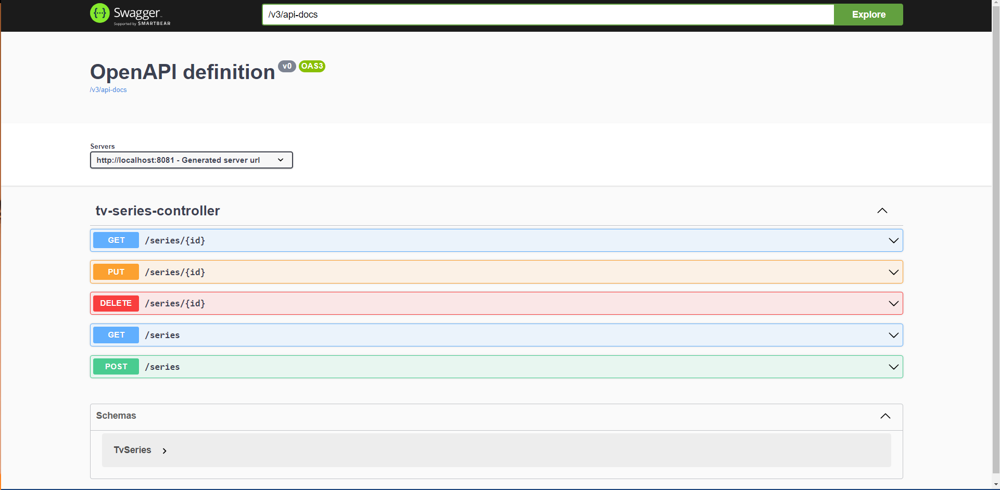
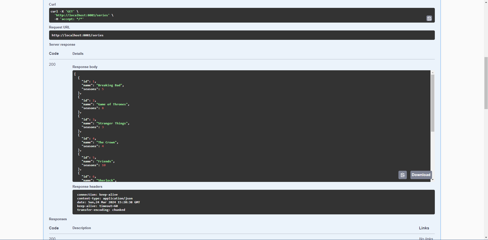
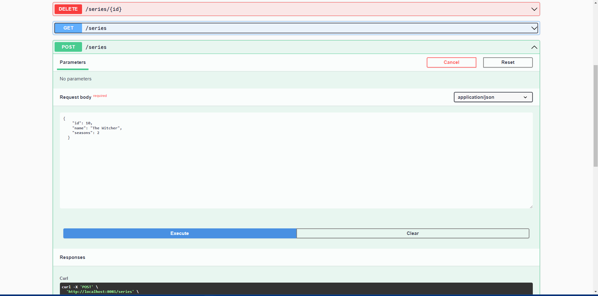
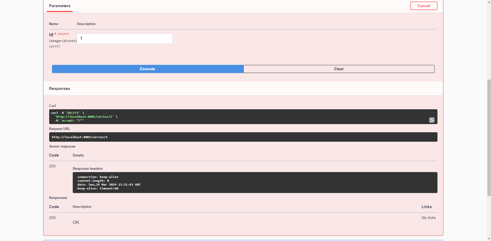

# API de Gerenciamento de Séries de TV

Esta API Java é projetada para fins didáticos para colocar em prática o que aprendi no curso [Documentação de API Rest com Swagger UI](https://www.jdevtreinamento.com.br/) e tem foco em
gerenciar informações sobre séries de Tv que já assisti. Ela oferece operações CRUD (Criar, Ler, Atualizar e Deletar) para manipular livros e suas informações relacionadas.

## Documentação da API🤖

A documentação da API foi gerada automaticamente usando o Swagger. Você pode acessá-la para entender como utilizar os endpoints e os modelos de dados oferecidos pela API.

Acesse a documentação da API em [Swagger UI]([url_da_documentação_swagger](https://swagger.io/solutions/api-documentation/)).

## Endpoints Disponíveis

- **GET /series**: Retorna todas as séries de TV.
- **GET /series/{id}**: Retorna uma série de TV específica pelo ID.
- **POST /series**: Adiciona uma nova série de TV.
- **PUT /series/{id}**:  Atualiza os detalhes de uma série de TV existente.
- **DELETE /series/{id}**:  Exclui uma série de TV pelo ID.

## Modificações

Troquei a forma como o Swagger é usada no curso. Tive problemas com a forma de configuração usada no curso, portanto escolhi
usar a que é indicada nesse vídeo [Como gerar uma API REST com Swagger e Spring Boot (2023) [OpenAPI Generator]](https://www.youtube.com/watch?v=zmfCS1E7oeI&ab_channel=Devertelo)
que é bem simples e você encontra na documetação do [Swagger](https://swagger.io/).

## Utilização

Para começar a utilizar a API, siga os seguintes passos:

1. Instale as dependências necessárias.
2. Inicie o servidor onde a API está hospedada.
3. Acesse a documentação da API para entender como enviar requisições para os endpoints disponíveis.
4. Comece a interagir com a API para gerenciar os livros de terror.

## Exemplo de Requisição

Para adicionar uma nova série, você pode enviar uma requisição POST para o endpoint `/series` com os dados do livro no corpo da requisição no formato JSON:

```json
{
  "id": 1,
  "name": "Breaking Bad",
  "seasons": 5
}

```
## Endpoints no Swagger

Você consegue acessar localmente (rodando a aplicação) o Swagger dos endpoints acima em `http://localhost:8081/swagger-ui/index.html#/`






